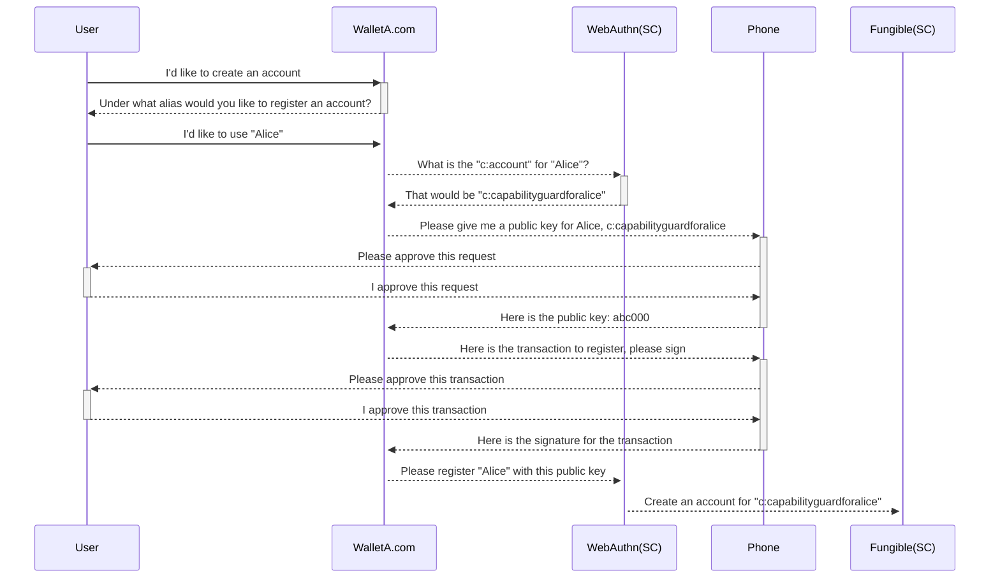
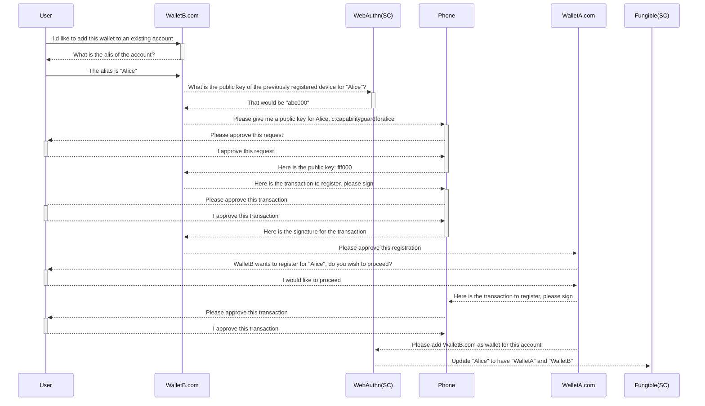
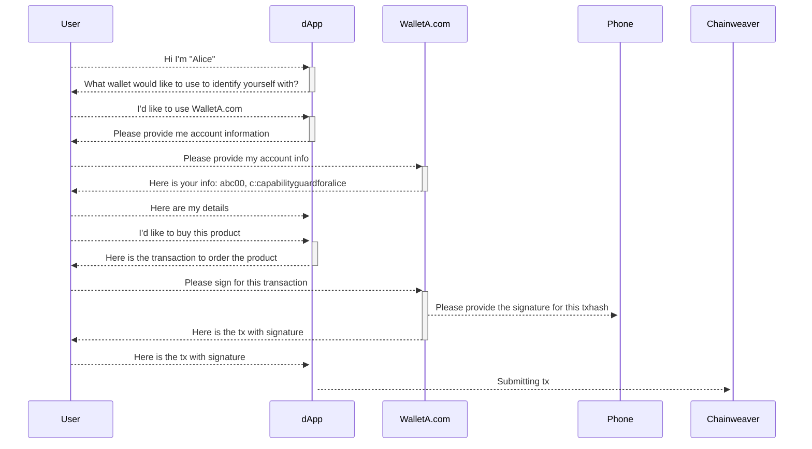

# WebAuthn

## Abstract

We propose to use WebAuthn signatures as an alternative option to the current
ED25519 signatures to allow users to approve for transactions processed through
Chainweb Node and Pact smart contracts.

## Motivation

WebAuthn allows for users to use a hardware powered device to store keypairs securely.
Users will be able to interact with those stored keypairs only by initiating a sign
request from the registered web domain. The private key never leaves the device
and the user never enters a password. This brings the user more security and convenience
simultaneously.

In comparison to current wallets, the wallet developers have no access to the
private keys. The user does not have to write down their mnemonics or even enter
their password to decrypt their privatekeys.

## Registration flow

## Registration flow (second wallet)

## Sign for transaction (dApp)

