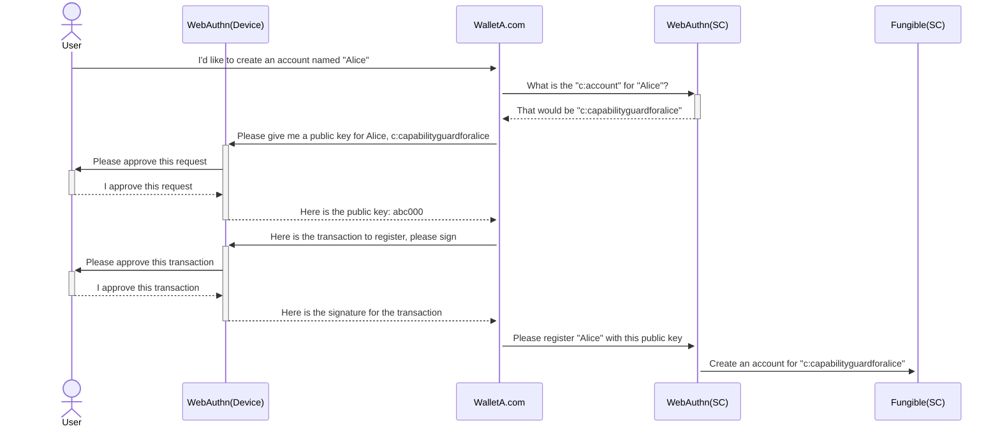
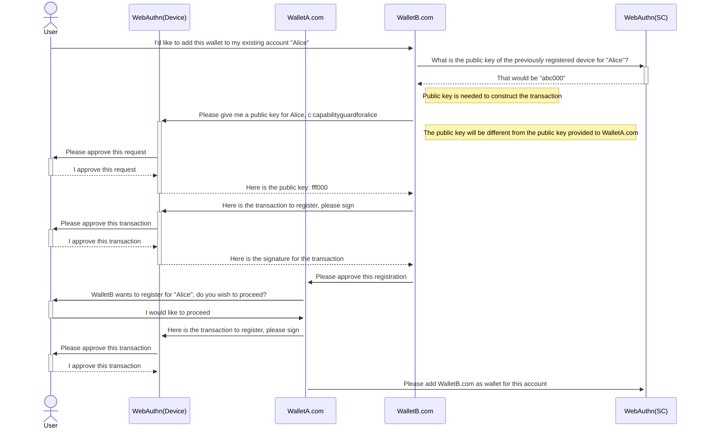
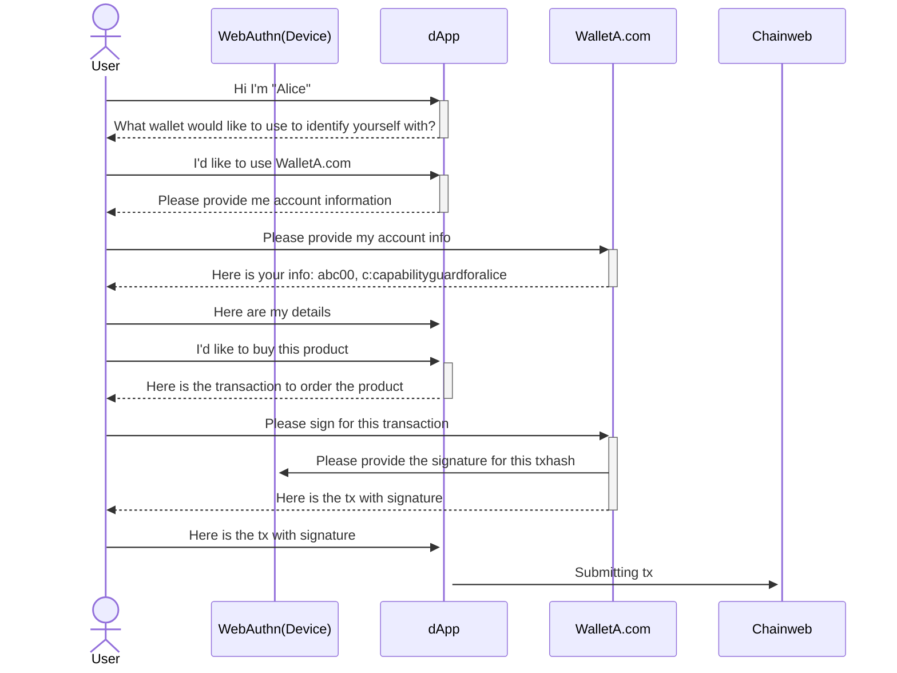
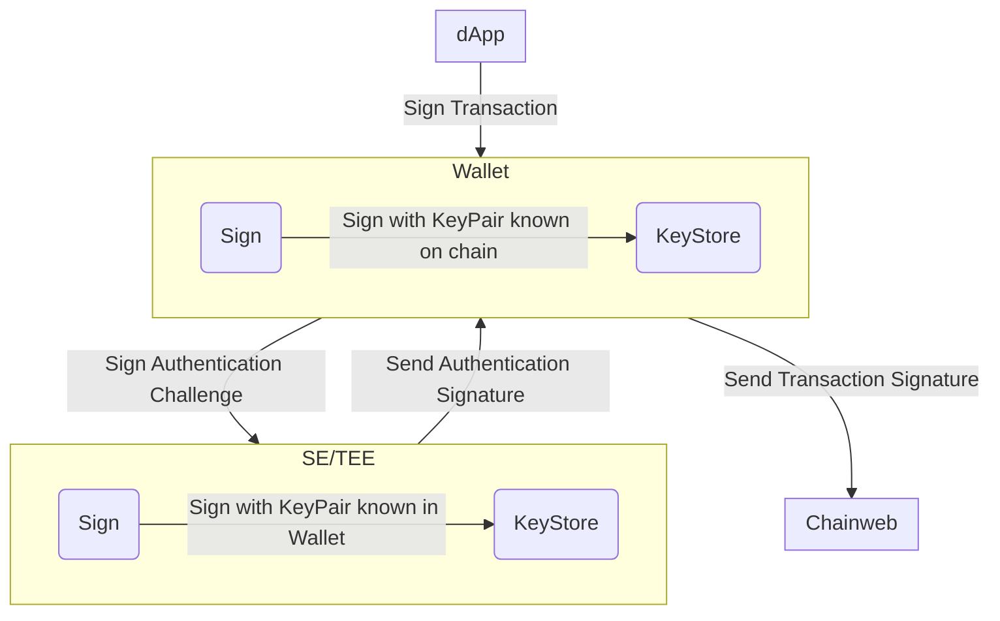
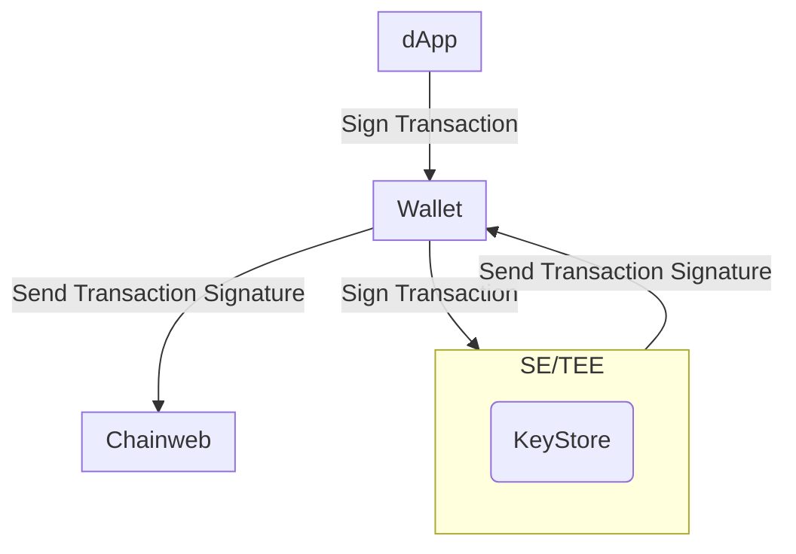

# Abstract

We propose to use WebAuthn signatures, an alternative option to ED25519
signatures, for creating passwordless accounts and approving transactions
processed through Chainweb Node and Pact smart contracts.

# Motivation

The current user experience for creating an account and signing for transactions
can be difficult to understand for users who are not already familiar with the
blockchain:

- The concept of public / private keypairs is not widely understood
- Wallets often generate a 12-24 word mneumonics that users need to store
  securely **in addition to** a traditional password

Furthermore, the security of accounts generated through many existing wallets is
actually centralized becuase user's keypairs are generated and stored by the
wallet. This means that if a wallet provider is no longer available or is
attacked, users may not be able to access their assets.

WebAuthn allows for users to securely generate and store keypairs directly on
their own hardware powered devices. These keypairs can typically be accessed via
Touch ID or Face ID which means that users are able to login / sign for
transactions **without passwords**. The combination of the private key never
leaving the hardware on the user's device and the user not having to securely
store a password brings the user more security. Additionally, the usage of
WebAuthn key pairs mirrors the ease of use in services like Apple Pay or Google
Pay making it more user friendly and convenient.

# Specifications

## Webauthn Pact Keysets

The WebAuthn public key that we provide to Chainweb Node is composed of a JSON
Web Key (JWK) that has been base64 encoded and prefixed with `WEBAUTHN-`. The
prefix indicates that different validation needs to be applied in Chainweb Node
and Pact. This, however, should not impact any smart contracts as WebAuthn
public keys are accepted as part of any keyset in Pact.

```pact
(env-data
  { 'ks :
    { 'keys :
    ["WEBAUTHN-a50102032620012158206fb822acf87bea4a37c2d5ff067675456bd38afc4f3d43afd0c7d2c94cd997d6225820c464ff1bccf536172dea9eb37ae3bbfc411bf129afda751ea2f7faace4dbf9c8"]
    , 'pred : 'keys-all
    }
  }
)
(enforce-keyset (read-keyset 'ks))
```

### WebAuthn Public Key

The JWK used to compose the public key for Pact keysets can be generated using
the
[Web Authentication API](https://developer.mozilla.org/en-US/docs/Web/API/Web_Authentication_API)
on the browser using specific
[configuration options](https://developer.mozilla.org/en-US/docs/Web/API/CredentialsContainer/create#publickey_object_structure)
to create an "account".

Notes about specific configuration options:

- `challenge`: When creating new credentials, a `challenge` will be requested by
  the Web Authentication API. Since we are only trying to retrieve the JWK and
  don't need to sign anything, the challenge value is arbitrary so we can
  provide any value that satisfies the API.
- `pubKeyCredParams`: Currently Chainweb Node only supports the `ES256`
  encryption algorithm. This is represented by the algorithm value `-7`
- `user`: The user requires an `id` which needs to be unique for every account.
  If a new account is created using the same `id` as an existing account, the
  former account will be overwritten and lost. It is best to ensure that this
  `id` is unique, otherwise you may not be able to access assets guarded by the
  Pact keyset derived from the lost account.
- `rp`: rp stands for `relying party` and will default to the document origin
  when it is omitted. This is provided because webauthn keys are always tied to
  a specific domain and cannot be used with any other domains

```js
var publicKeyConfig = {
  challenge: Uint8Array.from("arbitrary-string"),

  // Relying Party:
  rp: {
    name: 'Kadena WebAuthN Wallet',
    id: window.location.hostname, // defaults to the document origin when omitted
  },

  user: {
    id: Uint8Array.from("Alex Müller" + Date.now())
    name: 'alex.mueller@example.com',
    displayName: 'Alex Müller',
  },

  // This Relying Party will accept an ES256 credential
  pubKeyCredParams: [
    {
      type: 'public-key',
      alg: -7, // "ES256" as registered in the IANA COSE Algorithms registry
    },
  ],

  authenticatorSelection: {
    // Try to use UV if possible. This is also the default.
    userVerification: 'preferred',
  },

  timeout: 60000, // 1 minute

  attestation: "direct" // Retrieves the attestation statement as generated by the authenticator
};
```

## Chainweb Node Requests

When using WebAuthn to sign for transactions, Chainweb Node requires some
additional information to validate signatures.

> In the below json schema's the new or updated attributes are prefixed with a
> `+`.

### Sigs Payload

`ED25519` signatures are generated by signing the transaction `hash` using the
private key which Chainweb Node can validate using the public key.

When using WebAuthn signatures, the authenticator (the hardware device used to
generate the keyset and sign for transactions) will sign a message constructed
using `athenticatorData` and `clientDataJSON`. In order to validate the
signature, this data will need to be provided along with the signature to
Chainweb Node.

```json
{
  "cmd": string,
  "hash": string,
  "sigs": [
    {
      "sig": string,
+     "authenticatorData": string,
+     "clientDataJSON": string,
    }
  ]
}
```

### Command Payload

In the command payload the `signers` array provides information about the public
key(s) that will be signing the request. The `scheme` should indicate that the
signature will be provided via `WebAuthn`.

```json
{
  "payload": {
    "exec": {
      "code": string,
      "data": json
    },
  },
  "meta": {
    "chainId": string,
    "creationTime": number,
    "gasLimit": number,
    "gasPrice": number,
    "sender": string,
    "ttl": number
  },
  "networkId": string,
  "nonce": string,
  "signers": [{
    "clist": [{
      "name": string,
      "args": [string|number]
    }],
+   "pubKey": string,
+   "scheme": "ED25519" | "WebAuthn"
  }]
}
```

## WebAuthn Smart Contracts

In order to manage accounts guarded by a `WebAuthn` key, two new smart contracts
will be introduced: `webauthn-guard` and `webauthn-wallet`.

This approach creates a thin layer of abstraction over the keysets, enabling an
account to have multiple devices associated with it. As a result, an account is
not restricted to the devices known at the time of registration, but retains the
flexibility to add new devices or replace existing ones.

### WebAuthn Guard Smart Contract

The `webauthn-guard` contract handles account management and authorization. It
keeps track of all the keysets associated with an account and allows users to
configure how many keysets need to sign for authorization and additional keyset
registration requests.

> This account architecture takes inspiration from how keysets work in Pact. For
> example, a webauthn guard is like a multi-key keyset with a min approval
> predicate, however it allows for adding additional keys in retrospect and
> there can be custom min approval requirements for adding new keys.

The following is a snippet of the account schema from `webauthn-guard`:

```pact
(defschema device-schema
  name          : string
  domain        : string
  credential-id : string
  guard         : guard
)

(defschema account-schema
  @model [
    (invariant (> (length devices) 0))
    (invariant (< (length devices) 5))
    (invariant (> min-approvals 0))
    (invariant (> min-registration-approvals 0))
    (invariant (<= min-approvals (length devices)))
    (invariant (<= min-registration-approvals (length devices)))
  ]
  devices                    : [object{device-schema}]
  min-approvals              : integer
  min-registration-approvals : integer
)
```

> Note: `device` refers to a webauthn keyset in this context, however any keyset
> can be used as a `device`. (I think we should update it to keyset?)

The `id` for each `webauthn-guard` account is derived from the principal of the
keyset used to create the account. When creating the principal from the keyset,
Pact will recognize that the keyset is of type WebAuthn and will generate a
`w:account`. Since all WebAuthn keysets are unique, this ensures that only the
person who has access to that initial keyset can recreate the same `w:account`
on all other chains.

In the event where the first device has been lost, a user can make use of a
`copy` function which performs a `defpact` that copies the current
`account-schema` to a new chain. This is treated like a registration so the user
will have to satisfy the `min-registration-approval` requirements.

### WebAuthn Wallet Smart Contract

The `webauthn-wallet` contract was created to make it easy to integrate
`webauthn-guard` accounts with existing `fungible-v2` contracts.

To create a `fungible-v2` account, you need to provide an account name and a
guard. Since Pact also accepts capabilities as guards, `webauthn-wallet` does
the following:

- Creates a capability guard using the `w:account` from `webauthn-guard`
- Uses the `c:account` as the guard for the `fungible-v2` account

By using a capability guard we are able inherit the account properties of a
`webauthn-guard` account while also enforcing its requirements to guard the
`fungible-v2` account.

#### Account Management

Since each account has a `w:account` and a `c:account`, `webauthn-wallet` wraps
some functions so that users only have to keep track of their `c:account` to
simplify account management. `webauthn-wallet` wraps the following functions
from `webauthn-guard`:

- add-device
- remove-device
- copy-account

#### WebAuthn Wallet Capabilities

Since `fungible-v2` accounts will be guarded by a capability, transactions that
require authentication will need to bring the `webauthn-wallet.DEBIT` capability
into scope.

In most cases, contracts should be written with `webauthn-guard` and
`webauthn-wallet` in mind, however `coin` is an example of a contract that will
likely not be updated to accomodate `webauthn-wallet` accounts since it is
non-upgradable. Since you will not be able to bring the `webauthn-wallet.DEBIT`
capability into scope when using native `coin` functions/capabilities, the
`webauthn-wallet` contract has provided the following functions/capabilities
that can be used in place of their corresponding `coin` counterparts:

- `coin.transfer` _(function)_ -> `webauthn-wallet.transfer`
- `coin.GAS` _(capability)_ -> `webauthn-wallet.GAS_PAYER`
- `coin.TRANSFER` _(capability)_ -> `webauthn-wallet.TRANSFER`

## Registration flow



## Registration flow (second wallet)



## Sign for transaction (dApp)



## Sign flow Traditional Wallet



## Sign flow WebAuthn Wallet


