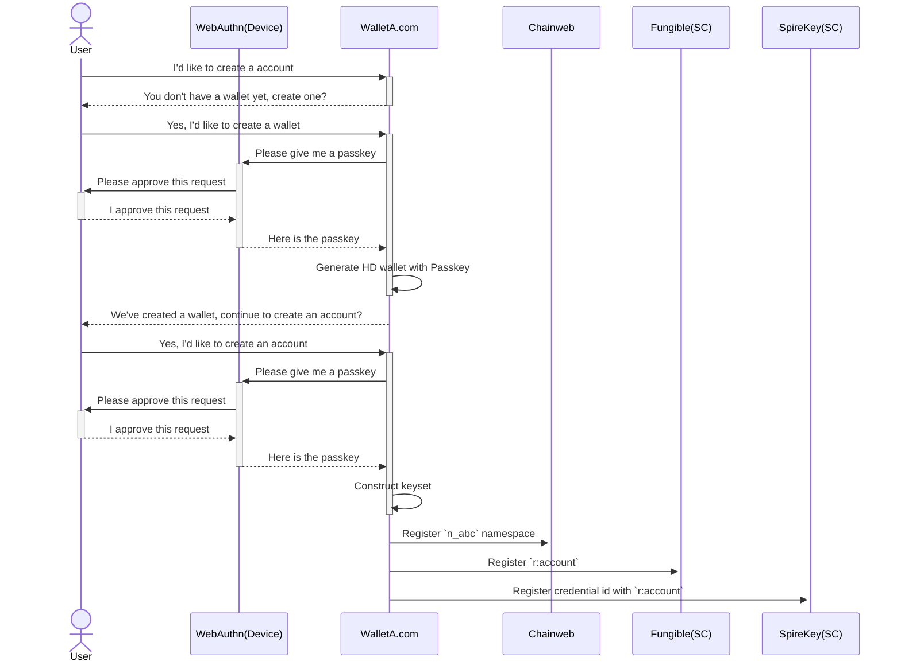
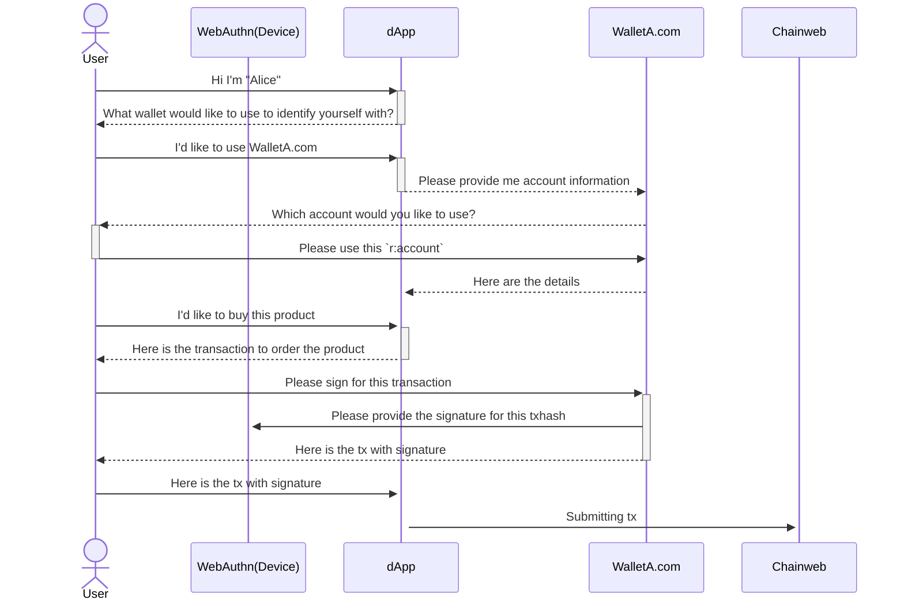
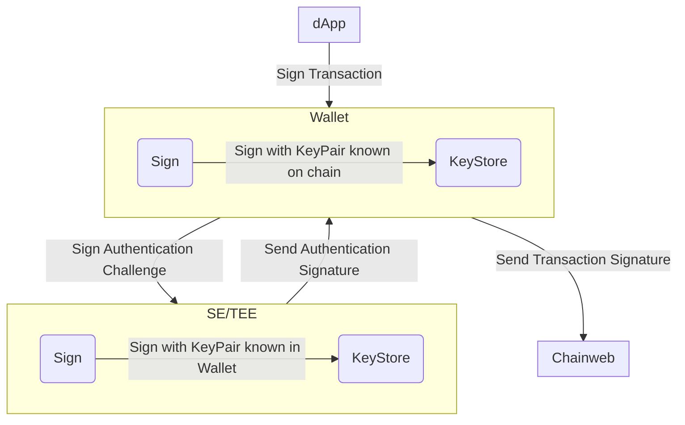
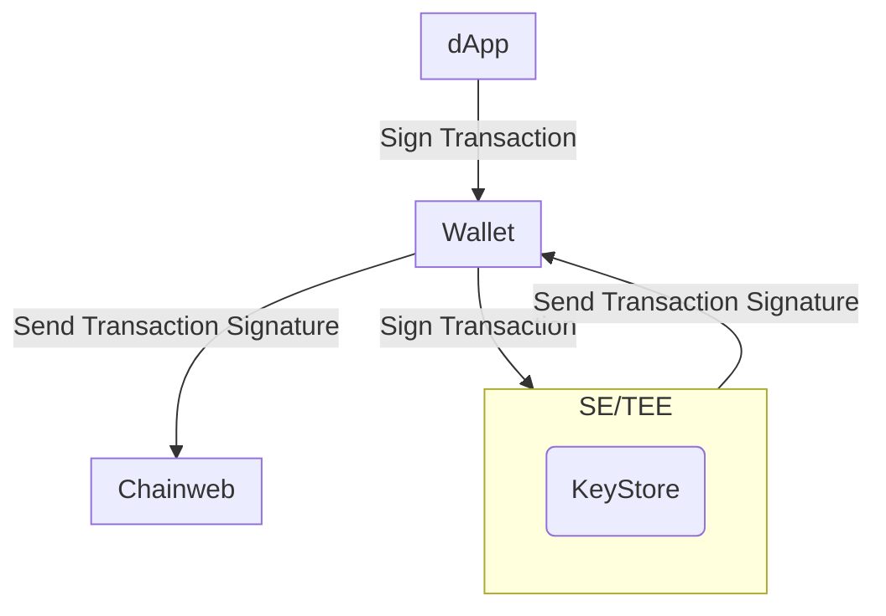

# Abstract

We propose leveraging WebAuthn signatures as an alternative to ED25519
signatures for creating passwordless accounts and approving transactions
processed through Chainweb Node and Pact smart contracts.

# Motivation

The current user experience for creating an account and signing transactions can
be challenging for users unfamiliar with blockchain technology:

- The concept of public / private keypairs is not widely understood.
- Wallets often generate a 12-24 word mnemonic phrase that users need to store
  securely in addition to a traditional password.

Wallets access their private keys via software. This means that if the wallet is
compromised, the user's key pairs can be used to sign without the user's
awareness. With Kadena SpireKey you will always be prompted to personally sign
for every transaction, which provides more security, transparency and control.

Mnemonic phrases are difficult to store securely and easy to lose. WebAuthn
enables users to securely generate and store key pairs directly on their own
hardware devices. There is no need to remember a mnemonic phrase. These key
pairs can typically be accessed via Touch ID or Face ID, allowing users to log
in and sign transactions without passwords. Since access is only granted using
biometric authentication, the need for passwords is removed. Additionally,
WebAuthn has a convienient service provided to sync the key pairs to the cloud,
in the form of `Passkeys`. This allows users to make use of any
`Passkey Provider` of their choice, removing the reliance on big corporations to
store key pairs.

# Specifications

## Account Creation

`coin` has removed the ability to rotate keysets since `v6`. This is to protect
users from front running attacks and squatting attacks. To allow new devices to
be added retroactively to an account, we need to use a principal type that
allows keysets to be rotated. This principal type is called `r:account`.

An `r:account` is created from a `keyset-ref-guard`. The part of a
`keyset-ref-guard` that propects the user from front running attacks and
squatting attacks is by utilizing `principal namespaces`. A
`principal namespace` is created using a `keyset`, ensuring only the owner of
that `keyset` to initialize that namespace on a chain.

A keyset that is used to create the `principal namespace` is not intuitive and
makes the onboarding more difficult. It's paramount to make sure the user has
access to the keyset to initialize the namespace on new chains. For this reason
one `Passkey` will be used as an entropy to create a HD wallet. A second
`Passkey` will be created to be part of the keyset to create the
`principal namespace` and `r:account`.

```pact
(env-data
  { 'ks :
    { 'keys :
      [ "WEBAUTHN-public-key"
      , "ED25519-public-key-derived-from-HD-wallet-with-Passkey-entropy"
      ]
    , 'pred : 'keys-any
    }
  }
)
```

With the keyset composed of a HD wallet derived public key and a Passkey, we can
start the process of creating the `principal namespace` and `r:account`. To
assist users maintaining their key pairs, we will store the credential id's on
chain in the `kadena.spirekey` contract. This allows wallets to keep track of
the devices that are authorized to sign for transactions and allow the
management of these devices to be decentralized.

```pact
(let* (
  (ns-name (ns.create-principal-namespace (read-keyset 'ns-keyset)))
  (ks-ref-name (format "{}.{}" [ns-name 'kadena]))
)
  (define-namespace
    ns-name
    (read-keyset 'ns-keyset )
    (read-keyset 'ns-keyset )
  )
  (namespace ns-name)
  (define-keyset ks-ref-name
    (read-keyset 'ns-keyset)
  )
  (let (
    (account (create-principal (keyset-ref-guard ks-ref-name)))
  )
    (coin.create-account
      account
      (keyset-ref-guard ks-ref-name)
    )
    (kadena.spirekey.add-device-pair
      account
      coin
      { 'guard          :  (read-keyset 'spirekey-keyset) ; keyset of HD wallet derived public key and Passkey
      , 'credential-id  :  "${credentialId}" ; Credential ID of the device
      , 'domain         :  "${domain}" ; https://example.com
      , 'device-type    :  "${deviceType}" ; AAGUID of the device or phone|desktop|security-key if not available
      , 'color          :  "${color}" ; hex color of the device (optional for user to customize and further identify the device across different wallets)
      }
    )
  )
)
```

## Transaction Signing

Transactions for the `r:account` should be encouraged to use the Passkey to
sign. This will be the most secure way to sign for transactions. There are
situations where it would be beneficial to use the HD wallet derived public key
to sign for transactions. Mainly for account maintenance and cross chain
transactions to prepare for a transaction in a dApp.

Using a HD wallet derived public key to sign for transactions is not as secure
as using the Passkey. The HD wallet derived public key is read into memory and
therefor can be targeted by malware, similar to traditional wallets. The Passkey
private key is never read into memory and therefor is more secure.

## Extracting Mnemonic Phrase

The Passkey used as entropy to create the HD wallet can be used to extract the
mnemonic phrase. This allows users to migrate to a traditional wallet if they
wish to do so and have another means to backup their wallet.

## Retrieving Passkey information

The JWK used to compose the public key for Pact keysets can be generated using
the
[Web Authentication API](https://developer.mozilla.org/en-US/docs/Web/API/Web_Authentication_API)
on the browser using specific
[configuration options](https://developer.mozilla.org/en-US/docs/Web/API/CredentialsContainer/create#publickey_object_structure)
to create an "account".

Notes about specific configuration options:

- `challenge`: When creating new credentials, a `challenge` will be requested by
  the Web Authentication API. Since the creation of new credentials only
  requires retrieval of the JWK and no signatures need to be created in the
  process, the challenge value is arbitrary so we can provide any value that
  satisfies the API.
- `pubKeyCredParams`: Currently Chainweb Node only supports the `ES256`
  encryption algorithm. This is represented by the algorithm value `-7`
- `user`: The user requires an `id` which needs to be unique for every account.
  If a new account is created using the same `id` as an existing account, the
  former account will be overwritten and lost. It is best to ensure that this
  `id` is unique, otherwise you may not be able to access assets guarded by the
  Pact keyset derived from the lost account.
- `rp`: rp stands for `relying party` and will default to the document origin
  when it is omitted. This is provided because webauthn keys are always tied to
  a specific domain and cannot be used with any other domains

```js
var publicKeyConfig = {
  challenge: Uint8Array.from("arbitrary-string"),

  // Relying Party:
  rp: {
    name: 'Kadena SpireKey',
    id: window.location.hostname, // defaults to the document origin when omitted
  },

  user: {
    id: Uint8Array.from("Alex Müller" + Date.now())
    name: 'alex.mueller@example.com',
    displayName: 'Alex Müller',
  },

  // This Relying Party will accept an ES256 credential
  pubKeyCredParams: [
    {
      type: 'public-key',
      alg: -7, // "ES256" as registered in the IANA COSE Algorithms registry
    },
  ],

  authenticatorSelection: {
    // Try to use UV if possible. This is also the default.
    userVerification: 'preferred',
  },

  timeout: 60000, // 1 minute

  attestation: "direct" // Retrieves the attestation statement as generated by the authenticator
};
```

The response from the Web Authentication API will contain the `credentialId` and
the `publicKey` which can be used to create a keyset for the `r:account`.

```json
{
  "id": "credentialId",
  "type": "public-key",
  "rawId": "Uint8Array",
  "response": {
    "clientDataJSON": "Uint8Array",
    "attestationObject": "Uint8Array"
  },
  "clientExtensionResults": {}
}
```

The AAGUID of the device can be used to identify the device. This can be used to
show the user what Passkey provider is used to store the key pairs. The AAGUID
can be retrieved from the `attestationObject` in the response from the Web
Authentication API. The AAGUID is a 16 byte value that is unique to the device
and can be used to identify the device. More information about the AAGUID can be
found here:

- [Determine Passkey with AAGUID](https://web.dev/articles/webauthn-aaguid)
- [AAGUID Mapping](https://github.com/passkeydeveloper/passkey-authenticator-aaguids)

## Chainweb Node Requests

When using WebAuthn to sign for transactions, Chainweb Node requires some
additional information to validate signatures.

> In the below json schema's the new or updated attributes are prefixed with a
> `+`.

### Sigs Payload

`ED25519` signatures are generated by signing the transaction `hash` using the
private key which Chainweb Node can validate using the public key.

When using WebAuthn signatures, the authenticator (the hardware device used to
generate the keyset and sign for transactions) will sign a message constructed
using `authenticatorData` and `clientDataJSON`. In order to validate the
signature, this data will need to be provided along with the signature to
Chainweb Node.

To do this, you will first need to create a JSON object of the `signature`,
`authneticatorData`, and `clientDataJSON`.

```json
{
+ "signature": string,
+ "authenticatorData": string,
+ "clientDataJSON": string,
}
```

You will then need to stringify this object and pass it to the `sig` field in
the transaction.

```json
{
  "cmd": string,
  "hash": string,
  "sigs": [{
+   "sig": string // Stringified JSON
  }],
}
```

### Command Payload

In the command payload the `signers` array provides information about the public
key(s) that will be signing the request. The `scheme` should indicate that the
signature will be provided via `WebAuthn`.

```json
{
  "payload": {
    "exec": {
      "code": string,
      "data": json
    },
  },
  "meta": {
    "chainId": string,
    "creationTime": number,
    "gasLimit": number,
    "gasPrice": number,
    "sender": string,
    "ttl": number
  },
  "networkId": string,
  "nonce": string,
  "signers": [{
    "clist": [{
      "name": string,
      "args": [string|number]
    }],
+   "pubKey": string,
+   "scheme": "ED25519" | "WebAuthn"
  }]
}
```

## Registration flow



## Sign for transaction (dApp)



## Sign flow Traditional Wallet



## Sign flow WebAuthn Wallet


